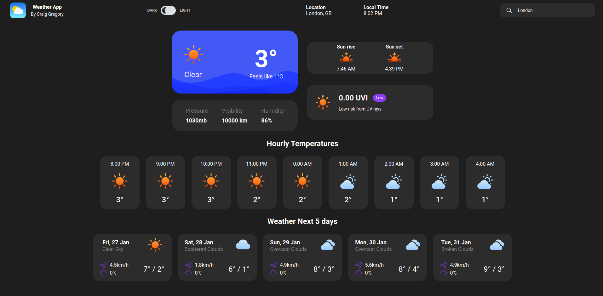
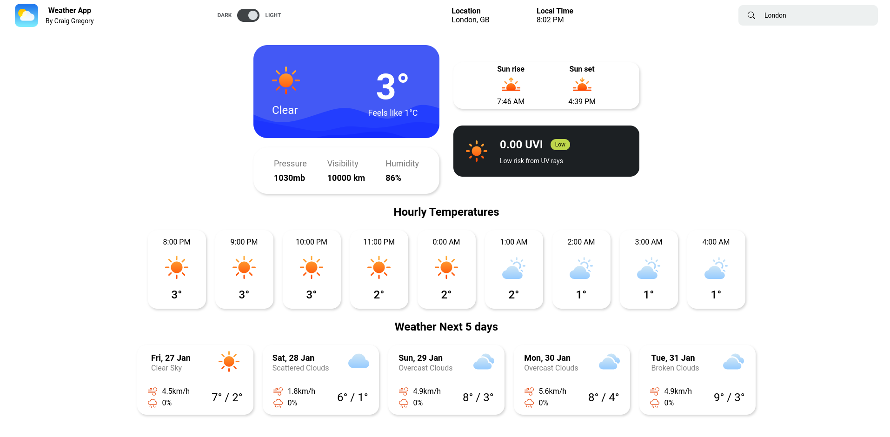

<h1 align="center">
React Weather App
</h1>
Check any locations current weather, hourly weather & weather for the next 5 days

#

## Table of contents

* [General info](#general-info)
* [Getting started](#getting-started)
* [Technologies](#technologies)
* [Features](#features)
* [Screenshots](#screenshots)
* [Live Demo](#live-demo)

## General info

What developers portolfio wouldn’t be complete without a weather app?! I’ve built a few weather apps in the past with vanilla JavaScript but I wanted to build one using React.

## Getting started

```
npm start
```

Runs the app in the development mode.\
Open [http://localhost:3000](http://localhost:3000) to view it in your browser.

```
npm run build
```

Builds the app for production to the `build` folder.\
It correctly bundles React in production mode and optimizes the build for the best performance.

The build is minified and the filenames include the hashes.\
Then the app is ready to be deployed!

## Technologies

Project is created with:

* React
* Axios
* SCSS

## Features

* Search any location in the world by name, display’s the location name and local time.
* Light / Dark mode
* Get current temperature and current weather type
* Sunrise / Sunset
* Pressure, Visibility & Humidity 
* UV index
* Display the next 9 hours hourly weather type & temp (displays in local time to the location you search)
* Check weather for the next 5 days
    * Temp high / low
    * Wind Speed
    * Chance of rain in %
    * Weather Type

## Screenshots

* Dark Mode


* Light Mode


## Live Demo


[Weather App](https://weather-dashboard-95d86.web.app/)